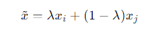
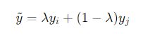

# BERT-base-cased Fine-tuning with Embedding MixUp Data Augmentation

## Описание проекта

Проект направлен на демонстрацию процесса файнтюнинга модели [BERT-base-cased](https://huggingface.co/bert-base-cased) на задаче классификации отзывов из датасета [Rotten Tomatoes](https://huggingface.co/datasets/rotten_tomatoes) с использованием метода аугментации данных MixUp на уровне эмбеддингов. 

https://arxiv.org/abs/2303.07864

## Основная идея

Вместо того чтобы обучаться на реальных данных, MixUp создает новые обучающие примеры следующим образом:

1. **Линейное смешивание входов**: Создается новый пример, который является линейной комбинацией двух случайно выбранных примеров из обучающего набора:

   

   где x_i и x_j  — входные данные, а lambda — коэффициент смешивания, случайным образом выбранный из бета-распределения.

   Аналогично для меток

   

## Преимущества

- **Улучшение обобщающей способности**: Модель учится на большем количестве уникальных примеров, что помогает улучшить её обобщающую способность.
- **Уменьшение переобучения**: Смешивание примеров делает модель менее склонной к переобучению на специфических деталях отдельных примеров.
- **Повышенная устойчивость к шуму**: Модель становится более устойчивой к шуму в данных, так как она обучается на более сглаженных примерах.

## Установка 

Для запуска трэйна понадобится cuda 11.8
Файнтюн на T4 занимает порядка 20 минут

1. 
   git clone https://github.com/revyu/base_bert_cased_Enmix.git
   cd base_bert_cased_Enmix

2. 
    python -m venv venv
    .\venv\Scripts\activate

3. 
    pip install -r requirements.txt

